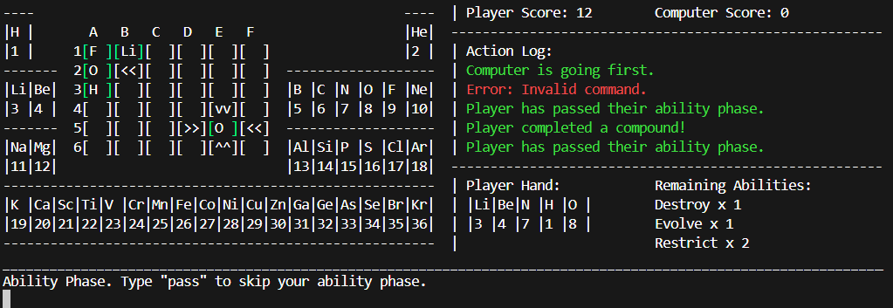
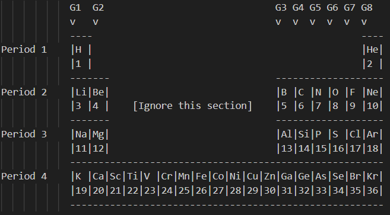
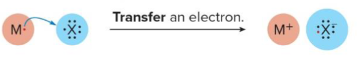

# **Chemistry Game** (Demo Video: https://youtu.be/Ac4t5nIyQHg)

## **Game Description:**
- A game based on covalent and ionic bonds in chemistry. This quarter I struggled in chemistry class quite a bit, so I decided to make a game based on a chemistry concept. In my game, you place atoms on the field to create chemical compounds and score points. To make things even more interesting, I added three unique strategy related abilities.
  
  

## **How to Run:**
- **Install Rust and Cargo:** The game is written in Rust. You must install the programming language and package manager. 
- **Clone Repo:** Clone the game repo to your machine. 
- **Navigate to Directory:** Move to the directory where the game is located.
- **Cargo Run:** Use the command “cargo run” to run the package.

## **How to Play:**
- **Chemistry Background:** To play my game, you need to know some background about chemistry. This is not a comprehensive list of what you should know, but hopefully it is enough to understand the game. 
  - **Atomic Number:** The number of protons that an atom has. Each element has a different atomic number.
  - **The Periodic Table:** The periodic table is a way of organizing elements in chemistry. Elements are arranged according to their atomic number in ascending order. For example, in the representation below, you can see that hydrogen (H) has an atomic number of one.
 
    

    The rows on the periodic table are called periods and the columns are called groups. When it comes to groups, you can ignore the elements in the center of the periodic table as shown in the diagram above.
  - **Valence Electrons:** Atoms are made up of protons, neutrons, and electrons. Electrons specifically are important when it comes to creating compounds. All atoms have special electrons called valence electrons. Valence electrons, explained simply, are the electrons within an atom that determine its stability. The periodic table can be used to determine the number of valence electrons an atom has. An atom’s group number is equal to its valence electrons!  
  - **Ionic and Covalent Bonds:** The most stable number of valence electrons is typically eight. Because of this, atoms share their valence electrons to become more stable. 
    - **Ionic Bonds:** An ionic bond is a bond between a metal and a non-metal atom. Metals are the atoms in group one and two of the periodic table. In the case of my game, everything else can be considered a non-metal.  

      As you can see in the diagram below, a metal with one valence electron donates to a non-metal, completing its octet (eight valence electrons).  
      
    - Covalent Bonds: A covalent bond is a bond between two non-metal atoms. In this case, electrons are shared between the atoms instead of transferred. 

      As shown in the diagram below, two non-metals with seven valence electrons engage in a covalent bond. The bonded electrons count as valence electrons for both atoms. As a result, the octet is satisfied for both atoms.
      
  - **Higher Order Bonds:** As seen in the diagram above, the sharing of two electrons is known as a single bond. However, atoms can share more than two valence electrons between themselves. Consider the example below.
 
    
    In this example, the lines between the oxygen atoms represent two shared valence electrons each. The other dots are unshared valence electrons. Adding up the shared and unshared electrons for each atom, you can see that the octet is complete.
  - **Number of Bonds by Group:** Using the periodic table, you can tell how many times an atom can bond based on its group.
 
        |       | G1 | G2 | G3 | G4 | G5 | G6 | G7 |
        |:------|:--:|:--:|:--:|:--:|:--:|:--:|:--:|
        | Bonds | 1  | 2  | 3  | 4  | 3  | 2  | 1  | 
