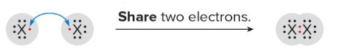

# **A Chemistry Game**

## **Game Description:**
- **Demo Video: https://youtu.be/Ac4t5nIyQHg**
- A game based on covalent and ionic bonds in chemistry. This quarter I struggled in chemistry class quite a bit, so I decided to make a game based on a chemistry concept. In my game, you place atoms on the field to create chemical compounds and score points. To make things even more interesting, I added three unique strategy related abilities.
  
  

## **How to Run:**
- **Install Rust and Cargo:** The game is written in Rust. You must install the programming language and package manager. 
- **Clone Repo:** Clone the game repo to your machine. 
- **Navigate to Directory:** Move to the directory where the game is located.
- **Cargo Run:** Use the command “cargo run” to run the package.

## **How to Play:**
- **Chemistry Background:** To play my game, you need to know some background about chemistry. This is not a comprehensive list of what you should know, but hopefully it is enough to understand the game. 
  - **Atomic Number:** The number of protons that an atom has. Each element has a different atomic number.
  - **The Periodic Table:** The periodic table is a way of organizing elements in chemistry. Elements are arranged according to their atomic number in ascending order. For example, in the representation below, you can see that hydrogen (H) has an atomic number of one.
 
    

    The rows on the periodic table are called periods and the columns are called groups. When it comes to groups, you can ignore the elements in the center of the periodic table as shown in the diagram above.
  - **Valence Electrons:** Atoms are made up of protons, neutrons, and electrons. Electrons specifically are important when it comes to creating compounds. All atoms have special electrons called valence electrons. Valence electrons, explained simply, are the electrons within an atom that determine its stability. The periodic table can be used to determine the number of valence electrons an atom has. An atom’s group number is equal to its valence electrons!  
  - **Ionic and Covalent Bonds:** The most stable number of valence electrons is typically eight. Because of this, atoms share their valence electrons to become more stable. 
    - **Ionic Bonds:** An ionic bond is a bond between a metal and a non-metal atom. Metals are the atoms in group one and two of the periodic table. In the case of my game, everything else can be considered a non-metal.  

      As you can see in the diagram below, a metal with one valence electron donates to a non-metal, completing its octet (eight valence electrons).
        
      
      
    - Covalent Bonds: A covalent bond is a bond between two non-metal atoms. In this case, electrons are shared between the atoms instead of transferred. 

      As shown in the diagram below, two non-metals with seven valence electrons engage in a covalent bond. The bonded electrons count as valence electrons for both atoms. As a result, the octet is satisfied for both atoms.
      
      
      
  - **Higher Order Bonds:** As seen in the diagram above, the sharing of two electrons is known as a single bond. However, atoms can share more than two valence electrons between themselves. Consider the example below.
 
    
    
    In this example, the lines between the oxygen atoms represent two shared valence electrons each. The other dots are unshared valence electrons. Adding up the shared and unshared electrons for each atom, you can see that the octet is complete.
  - **Number of Bonds by Group:** Using the periodic table, you can tell how many times an atom can bond based on its group.
 
         Groups | G1 | G2 | G3 | G4 | G5 | G6 | G7
         ------ | -- | -- | -- | -- | -- | -- | --
         Bonds  | 1  | 2  | 3  | 4  | 3  | 2  | 1
    
  - **Game Rules:** 

    - **Turns:** The game randomly decides if the player or computer moves first. The game consists of sixteen total turns (eight turns per player). There are two phases in each turn.  
      - **Ability Phase:** At the start of each turn, the player can choose to use an ability. The player can only use one ability each turn. The player can use the “pass” command to skip the ability phase. 

      - **Main Phase:** During the main phase, the player must play an atom card from their hand. This is done with the “play” command. 

        Example of “play” command:

        

    - **Deck:** The player and computer draw cards from identical decks. Each hand has five cards. 
      - **Deck Contents:** 4H, 4O, 2Li, 2Be, 2C, 1N, 1F. 
    - **Bonding:** 
      - **Empty Spaces:** When you play an atom on an empty space, bonding zones are created around it. Bonding zones point toward the atom they belong to. If a tile where a bonding zone would be created is already occupied, no bonding zone is created.
     
        

      - **Bonding Zones:** When you play an atom on a bonding zone, there are some important rules to follow: 
        - **Metals cannot bond directly to each other:** As explained in the chemistry background section, metals can only bond to non-metals.

          

        - **Different metals cannot exist within the same compound:** It is not possible for two different metals to exist within the same compound.
       
          

          If the above rules are satisfied, then bonding will occur between the played atom and the atom that the bonding zone belongs to. By default, the largest possible bond is created between the two atoms. If an atom uses up all of its bonds, then its bonding zones disappear. Refer to the number of bonds by group (in chemistry background section) to predict how atoms will bond together. 
      - **Stable Compounds:** A compound is considered complete when it is stable. Whichever player completes a compound gets the points for it. After a compound is stable, it remains on the board as an obstacle. 
        - **Point Calculation:** (sum of atomic numbers in compound) * (largest bond in compound). 

          Below, the computer scored six points by creating a stable compound.

          

    - **Abilities:** 
      - **Destroy:** Target an atom on the field and destroy the compound that it belongs to. (Turn it into empty tiles.) 
      - **Restrict:** Select two tiles. Atoms cannot be played on those tiles for two turns. (For the rest of your turn until the start of your next turn.)

        

      - **Evolve:** Target an atom in your hand. Increase the period of that atom. (Same group but one period higher). 
    - **Precedence:** Ownership over bonded zones is determined by precedence. If a bonded zone changes ownership (because a compound was stabilized) it defaults to the atom with higher precedence. Atoms played earlier in the game have higher precedence. 
    - Command List:
      - **Specifying Tiles:** Tiles are specified by collumn letter followed by row number. (**Example:** Collumn A, Row 4 -> A4)
      - **Specifying Atoms:** Atoms are specified by their abreviation on the periodic table. Case sensitivity is important. (**Example:** Lithium -> Li)
      - **start** -> Starts the game from the start or end screen.
      - **quit** -> Quits the game from the end screen. 
      - **pass** -> Skips the ability phase. 
      - **destroy *tile*** -> Destroys the compound at the given tile. 
      - **restrict *tile* *tile*** -> Converts the two specified tiles into restricted tiles. 
      - **evolve *atom*** -> Evolves the given atom in the player’s hand. 
      - **play *atom* *tile*** -> Plays atom at given tile if possible.

## **Difficulties and Solutions:** 
- The most difficult part of this assignment was using Rust for the first time. I had to rethink many problems during this assignment because Rust did not work how I expected. Despite these frustrations, my solution was to remain calm and apply what I learn about the language carefully. 
- A second challenging aspect of this assignment was the scope of the game. I underestimated the scope of my game, and it took longer to complete than expected.  There were times when I wanted to remove some of the functionality just to finish it faster, but I ultimately fully implemented my idea. My solution to the large scope of this assignment was to approach problems carefully and take my time. 

## **The Good, the Bad, and the Ugly:** 
- **Likes:** One thing that I liked about this experience was realizing my game idea. Although achieving the result was difficult, it feels good to make something that I am proud of. Another thing that I liked was getting Introduced to Rust. This project helped me to develop a basic understanding of the language. 
- **Dislikes:** I disliked the scope of the project that I chose. Since my project was bigger than I expected, I had to deal with many unexpected issues when coding. For example, I didn’t consider the issue of precedence until I realized that bonding zones sometimes need to be reassigned.  

## **Learning Experience:** 
- After learning from this assignment, one area that I could improve in my programming is composition. For this assignment, I made a variety of specific classes for different parts of the game. Because my classes were tailored to specific parts of the game, they did not always communicate smoothly with each other. I want to work on composition so that my code is more flexible across the entire program.
